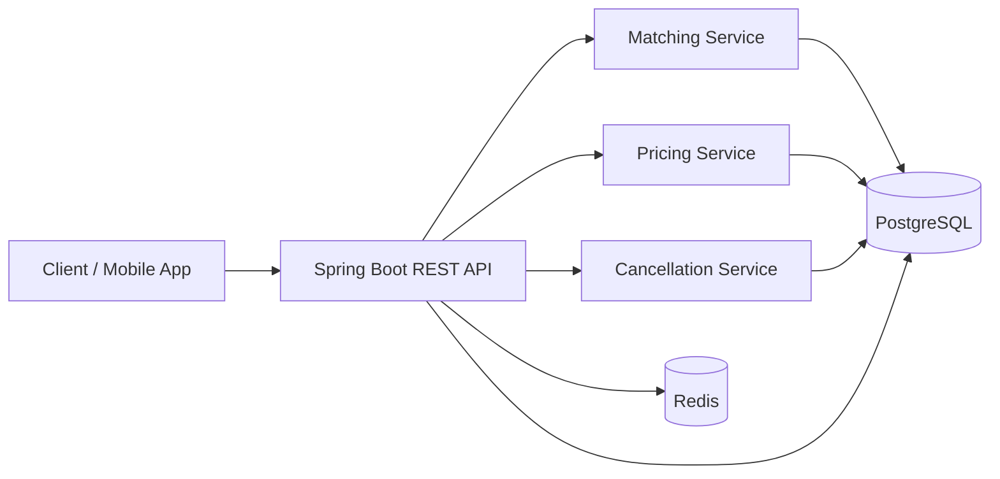
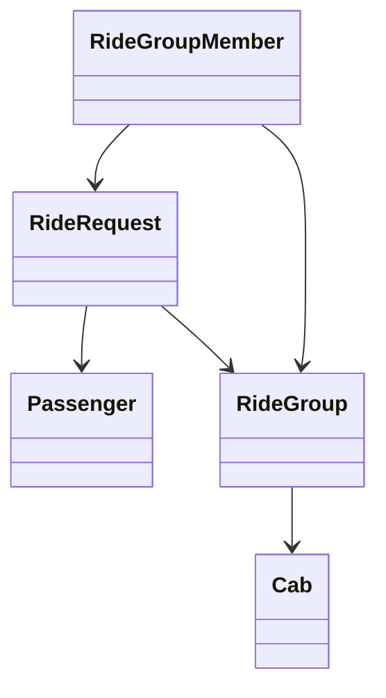

# Smart Airport Ride Pooling Backend (Spring Boot)

Backend system that groups passengers into shared cabs for airport trips while optimizing routes and pricing.

## Assignment Compliance Matrix

| Requirement | Status | Evidence |
|---|---|---|
| Group passengers into shared cabs | Implemented | `src/main/java/com/hintro/airportpooling/service/MatchingService.java` |
| Respect luggage and seat constraints | Implemented | `MatchingService#hasCapacity`, `RideRequestService#createRequest` |
| Minimize total travel deviation | Implemented | `src/main/java/com/hintro/airportpooling/service/RoutePlanner.java` |
| Ensure no passenger exceeds detour tolerance | Implemented | Detour validation in `RoutePlanner#buildPlan` |
| Handle real-time cancellations | Implemented | `src/main/java/com/hintro/airportpooling/service/CancellationService.java` |
| Support 10,000 concurrent users | Architecture-ready | Stateless API + DB locks + Redis + horizontal scaling plan |
| Handle 100 requests per second | Architecture-ready + load script | `docs/loadtest/k6-pricing-rps100.js` |
| Maintain latency under 300ms | Targeted + measurable | k6 threshold `p(95)<300` in load script |
| DSA approach + complexity | Implemented | Section "DSA Approach" below |
| Low level design + patterns | Implemented | Section "Low Level Design" below |
| High level architecture diagram | Implemented | Mermaid diagram below |
| Concurrency handling strategy | Implemented | Section "Concurrency Strategy" + repository locks |
| Database schema + indexing | Implemented | `src/main/resources/db/migration/V1__init.sql` |
| Dynamic pricing formula | Implemented | `src/main/java/com/hintro/airportpooling/service/PricingService.java` |
| Working backend code | Implemented | Full Spring Boot project |
| Runnable locally | Implemented | Docker Compose run path below |
| Required APIs implemented | Implemented | Controllers in `src/main/java/com/hintro/airportpooling/controller` |
| Concurrency handling in code | Implemented | Pessimistic locks + optimistic version columns |
| Migrations/setup scripts | Implemented | Flyway `V1__init.sql`, `V2__sample_data.sql` |
| API docs (Swagger/OpenAPI/Postman) | Implemented | Swagger + Postman collection |
| Sample test data | Implemented | `V2__sample_data.sql` |
| Testability and maintainability | Implemented | Unit tests + layered architecture |

Notes:
- Performance goals (10k users, 100 RPS, sub-300ms) require proper infra sizing in real deployment.
- This repo includes a reproducible load test script for validation.

## Tech Stack
- Java 17
- Spring Boot 3.2
- PostgreSQL
- Redis
- Flyway
- Swagger/OpenAPI (`springdoc`)
- Docker + Docker Compose
- JUnit 5

## High Level Architecture


## Low Level Design
Patterns used:
- Repository Pattern: Spring Data JPA repositories
- Service Layer Pattern: domain/business logic in services
- DTO Mapping Layer: API contracts decoupled from entities
- Scheduler Pattern: periodic batch matching
- Optimistic + Pessimistic Concurrency control

Core entities:
- `Passenger`
- `RideRequest`
- `RideGroup`
- `RideGroupMember`
- `Cab`

Class diagram:


## DSA Approach and Complexity

Matching approach:
- Candidate group search by direction + time window.
- Greedy best-insertion heuristic over stop order.
- Validate seat/luggage capacity.
- Validate per-passenger detour tolerance before assignment.

Complexity:
- `G` = number of candidate groups.
- `K` = max members per group (small, configurable; default 4).
- Per request: `O(G * K^2)` for trying insertion positions and recalculating route/detour.
- Effective runtime is fast because `K` is bounded and small.

## Concurrency Strategy
- `@Lock(PESSIMISTIC_WRITE)` on critical selection/update queries.
- `@Version` columns on mutable entities for optimistic conflict safety.
- Matching executed transactionally to avoid double assignment.
- Cab allocation is locked and transactional.

## Database Schema and Indexing
Migration file:
- `src/main/resources/db/migration/V1__init.sql`

Indexes:
- `idx_requests_status_time` on `(status, desired_pickup_time)`
- `idx_requests_direction_status` on `(direction, status)`
- `idx_requests_assigned_group` on `(assigned_group_id)`
- `idx_groups_status_direction` on `(status, direction)`
- `idx_group_members_group` on `(ride_group_id, stop_order)`

Sample data:
- `src/main/resources/db/migration/V2__sample_data.sql`

## Dynamic Pricing Formula
Implemented in `PricingService`.

```text
fare = (baseFare + perKm * directDistance)
       * surgeMultiplier
       * (1 - sharedDiscount)

sharedDiscount = min(maxSharedDiscount, (groupSize - 1) * sharedDiscountPerExtra)
surgeMultiplier = min(2.0, max(1.0, surgeBase + 0.05 * demandSupplyRatio))
demandSupplyRatio = pendingRequests / max(availableCabs, 1)
```

## APIs
Swagger/OpenAPI:
- Swagger UI: `http://localhost:8080/swagger-ui.html`
- OpenAPI: `http://localhost:8080/api-docs`

Postman collection:
- `docs/postman/Smart-Airport-Ride-Pooling.postman_collection.json`

Endpoints:
- `POST /api/passengers`
- `GET /api/passengers/{id}`
- `POST /api/cabs`
- `GET /api/cabs`
- `POST /api/requests`
- `GET /api/requests/{id}`
- `POST /api/requests/{id}/cancel`
- `POST /api/match/run`
- `GET /api/groups`
- `GET /api/groups/{id}`
- `GET /api/pricing/estimate`

## Run Locally (No local Postgres/Redis installation required)

Prerequisite:
- Docker Desktop (or Docker Engine + Compose plugin)

Run everything (App + Postgres + Redis):
```bash
docker compose up --build
```

Optional:
- Copy `.env.example` to `.env` and override values if needed.

Stop and remove containers + volumes:
```bash
docker compose down -v
```

PowerShell helper scripts:
- `scripts/run-docker.ps1`
- `scripts/stop-docker.ps1`

## Alternative Local Run (with local Java/Maven)
If you already have Java 17 + Maven and your own Postgres/Redis:
```bash
mvn spring-boot:run
```

## Deployment

### Container deployment
1. Build image:
```bash
docker build -t airport-pooling:0.1.0 .
```

2. Run container (point to external Postgres/Redis):
```bash
docker run -p 8080:8080 \
  -e SPRING_DATASOURCE_URL=jdbc:postgresql://<db-host>:5432/airport_pooling \
  -e SPRING_DATASOURCE_USERNAME=<db-user> \
  -e SPRING_DATASOURCE_PASSWORD=<db-password> \
  -e REDIS_HOST=<redis-host> \
  -e REDIS_PORT=6379 \
  airport-pooling:0.1.0
```

### Production scaling notes
- Run multiple stateless app replicas behind a load balancer.
- Use managed PostgreSQL with connection pooling.
- Use managed Redis for cache and low-latency reads.
- Configure autoscaling and observability before claiming SLA.

## Testing
Unit tests:
- `src/test/java/com/hintro/airportpooling/RoutePlannerTest.java`
- `src/test/java/com/hintro/airportpooling/PricingServiceTest.java`

Run tests:
```bash
mvn test
```

Load test (100 RPS target example):
- Script: `docs/loadtest/k6-pricing-rps100.js`
- Command (k6 installed):
```bash
k6 run docs/loadtest/k6-pricing-rps100.js
```
- Command (Dockerized k6, no local install):
```bash
docker run --rm -i --network host grafana/k6 run - < docs/loadtest/k6-pricing-rps100.js
```

## Assumptions
- Airport coordinates are configurable in `application.yml`.
- Routing is distance-based (no live traffic API integration).
- Max pool size is configurable and bounded.
- Time window strategy is configurable.

## Submission Checklist
1. Push this repository to GitHub/GitLab/Bitbucket.
2. Ensure README is present and up to date.
3. Keep Swagger/OpenAPI enabled.
4. Include Postman collection from `docs/postman`.
5. Include migrations and sample data (`V1`, `V2`).
6. Include test instructions and load-test script.
7. Share repository URL in submission.
